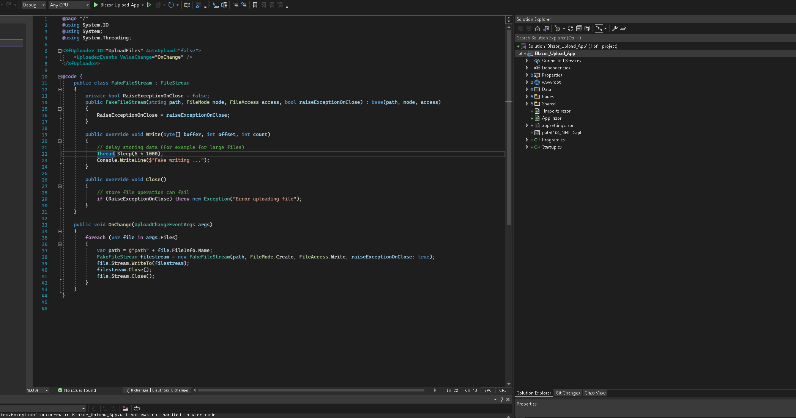

# sf-question

This is just a repo to ask SF how to deal with store issues on uploading files on server side.

When a file is uploaded on serverside, the SF component raises `OnChange` event. This is the way to take file stream and file details and store it wherever you want on backend side.

I have several issues:

* The SF component's progress bar is not showing how file is upload, is just about how SF component is getting stream. The progress bar at 100% doesn't mean the file is 100% upload, it means the file is starting upload. For small files this is not important, but, for large files, SF controls says to the user the file is 100% upload and it's not, is just starting uploading. If the user closes the browser, the file will not be stored anymore.
* If they are an error storing the file, the SF control doesn't realize. It says 'Upload successfully'. Neither no Fail event is raised.

To ilustrate it, in this code, I wrote a FakeStremWriter that delays write operation for 5 seconds. Also, the FakeStreamWriter fails on close. **Expected** behavior is that the progress bar takes 5 seconds to be at 100% and, after that, an error message appears to the user. But, the result is that SF Control says to the user that the file is stored when it's no (5 seconds delay) also say successflully and is not, because close operation fails.

I would like to know what is the code pattern to work with SF serverside upload control and deal with these issues (delay to store file on backed, fail on store file on backend)

